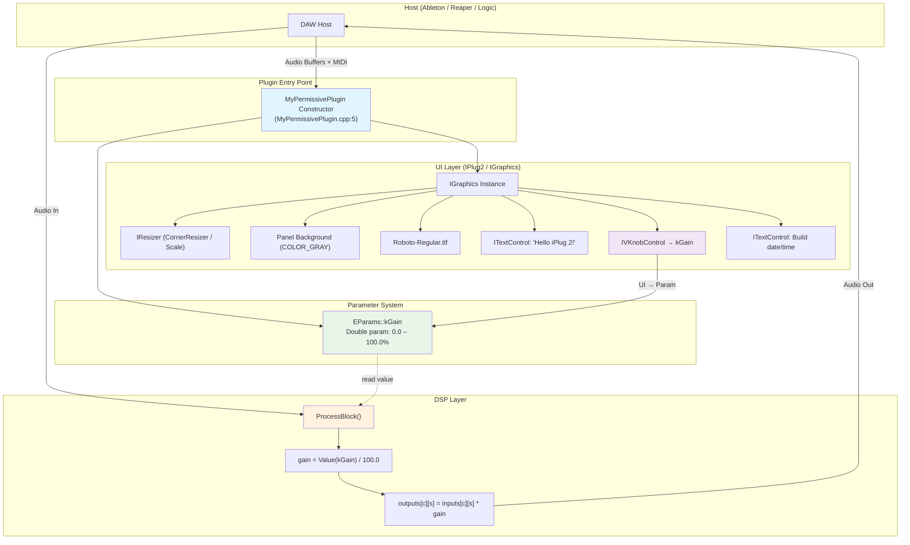

# MyPermissivePlugin — VST3 Audio Plugin

A minimal, commercially-friendly VST3 audio plugin built on the **iPlug2** framework. This is a gain/gain-control plugin with a single knob parameter and a clean, scalable UI.

---

## Quick Stats

| Attribute | Value |
|---|---|
| **Plugin Name** | MyPermissivePlugin |
| **Version** | 1.0.0 |
| **Framework** | iPlug2 (http://bit.ly/3dP8k0s) |
| **Target Format** | VST3 (macOS + Windows) |
| **Audio Engine** | Steinberg VST3 SDK (via iPlug2) |
| **Graphics** | NanoVG / Metal (macOS), NanoVG / GL2 (Windows) |
| **Build System** | CMake 3.14+ |
| **License** | Proprietary / Commercial (your code is yours) |

---

## Data Flow Diagram



---

## Architecture Overview

### File Structure

```
MyPermissivePlugin/
├── CMakeLists.txt              # CMake build config (formats, sources, resources)
├── MyPermissivePlugin.h        # Plugin class declaration + parameter enum
├── MyPermissivePlugin.cpp      # Constructor (UI setup) + ProcessBlock (DSP)
├── config.h                    # Plugin metadata (name, vendor, version, etc.)
│
├── config/                     # Per-platform build configs
│   ├── MyPermissivePlugin-mac.xcconfig
│   ├── MyPermissivePlugin-win.props
│   ├── MyPermissivePlugin-wasm.mk
│   └── MyPermissivePlugin-web.mk
│
├── resources/                  # Icons, fonts, platform-specific assets
│   ├── fonts/Roboto-Regular.ttf
│   ├── MyPermissivePlugin.icns      (macOS icon)
│   ├── MyPermissivePlugin.ico       (Windows icon)
│   └── MyPermissivePlugin-VST3-Info.plist  (VST3 bundle metadata)
│
├── projects/                   # IDE project files (Xcode, Visual Studio)
│   ├── MyPermissivePlugin-vst3.vcxproj  (Windows VST3)
│   ├── MyPermissivePlugin-iOS.xcodeproj
│   └── MyPermissivePlugin-macOS.xcodeproj
│
├── scripts/                    # Build / post-build scripts
│   ├── prepare_resources-mac.py
│   ├── prepare_resources-win.py
│   └── postbuild-win.bat
│
├── build/                      # CMake output directory (gitignored)
│   └── out/MyPermissivePlugin.vst3/  ← Final plugin bundle
│
└── dependencies/               # iPlug2 + VST3 SDK (git submodule or vendored)
    └── iplug2/
```

### Component Interaction

```
┌──────────────────────────────────────────────────────────────┐
│                        CMakeLists.txt                         │
│  - Sets IPLUG2_DIR → ../../dependencies/iplug2               │
│  - Calls iplug_add_plugin() with SOURCES, RESOURCES, FORMATS │
│  - Output: MyPermissivePlugin.vst3                           │
└──────────────────────┬───────────────────────────────────────┘
                       │
          ┌────────────┴────────────┐
          │                         │
┌─────────▼──────────┐   ┌─────────▼──────────┐
│  MyPermissivePlugin │   │  IGraphics /       │
│  .h + .cpp         │   │  IControls         │
│                  │   │
│  Constructor:     │◄──┤  UI Layout:        │
│  - InitParam(kGain)│   │  - IVKnobControl   │
│  - mMakeGraphics   │   │  - ITextControl    │
│  - mLayoutFunc     │   │                    │
│                  │   │  Font: Roboto        │
│  ProcessBlock():  │   └────────────────────┘
│  - Read kGain     │
│  - Multiply input │   ┌────────────────────┐
│  - Write output   │   │  VST3 Host (Ableton) │
└───────────────────┘   │                    │
                        │  Scans ~/Library/  │
                        │  Audio/Plug-Ins/   │
                        │  VST3/             │
                        └────────────────────┘
```

---

## Prerequisites

| Tool | Version | Install Command |
|---|---|---|
| Xcode Command Line Tools | 14+ | `xcode-select --install` |
| CMake | 3.14+ | `brew install cmake` |
| Git | — | `brew install git` |

---

## Building

### Step 1 — Configure

```bash
cd MyPermissivePlugin
mkdir -p build && cd build
cmake ..
```

### Step 2 — Build

```bash
cmake --build . --config Release -j$(sysctl -n hw.ncpu)
```

### Step 3 — Install to VST3 Directory

```bash
# The build copies the plugin automatically to:
#   /Users/true/Documents/VST3/MyPermissivePlugin.vst3

# Copy to the standard macOS VST3 location:
cp -R /Users/true/Documents/VST3/MyPermissivePlugin.vst3 \
      ~/Library/Audio/Plug-Ins/VST3/

# Re-sign (required by macOS + Ableton):
codesign -f --sign - ~/Library/Audio/Plug-Ins/VST3/MyPermissivePlugin.vst3
```

### Step 4 — Verify in DAW

Open Ableton Live → Preferences → Audio → Browse → **Rescan**.  
`MyPermissivePlugin` should appear in the Instruments category.

---

## Parameter Reference

| Enum | Name | Type | Min | Max | Default | Unit |
|---|---|---|---|---|---|---|
| `kGain` | Gain | Double | 0.0 | 100.0 | 0.0 | % |

The gain is applied as a linear multiplier: `output = input × (gain / 100)`.

---

## Build Configuration Options

### Changing Output Formats

Edit `CMakeLists.txt` line 29:

```cmake
# Current — VST3 only
iplug_add_plugin(${PROJECT_NAME} ... FORMATS VST3)

# Add more formats:
iplug_add_plugin(${PROJECT_NAME} ... FORMATS VST3 AU CLAP)

# All formats:
iplug_add_plugin(${PROJECT_NAME} ... FORMATS ALL)
```

### Changing Graphics Backend

```bash
cmake -DIGRAPHICS_BACKEND=SKIA -DIGRAPHICS_RENDERER=GL3 ..
```

| Platform | Default Backend | Default Renderer |
|---|---|---|
| macOS | NANOVG | METAL |
| Windows | NANOVG | GL2 |

---

## Troubleshooting

### Plugin Not Showing in Ableton

1. **Check installation path** — Ableton scans `~/Library/Audio/Plug-Ins/VST3/` on macOS
2. **Re-sign the plugin:** `codesign -f --sign - ~/Library/Audio/Plug-Ins/VST3/MyPermissivePlugin.vst3`
3. **Rescan** in Ableton's Plugin Path preferences
4. **Check console:** Open Terminal and run `log stream --predicate 'process == "Ableton Live"'` while launching

### Build Errors

- Ensure Xcode Command Line Tools: `xcode-select --install`
- Ensure CMake 3.14+: `cmake --version`
- Clean rebuild: `rm -rf build && mkdir build && cd build && cmake .. && cmake --build .`

---

## License

- **Your plugin code** — You own 100%. No restrictions.
- **iPlug2** — MIT License (https://github.com/iPlug2/iPlug2)
- **VST3 SDK** — Steinberg VST3 SDK License (free for commercial use)